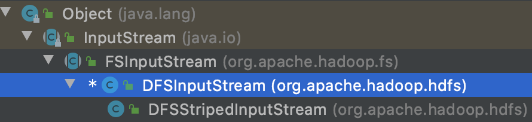
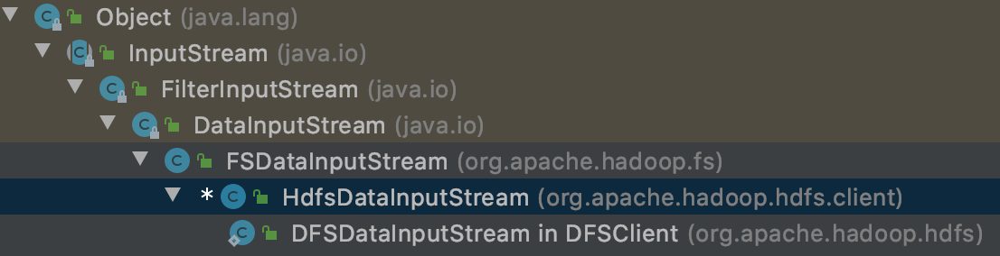

# 1. 前言

Apache Hadoop是一个用于分布式处理海量数据的软件框架，它主要包括：

- Hadoop Common：其它Hadoop模块的公共库；
- HDFS：分布式文件系统，用于向提供高吞吐的数据访问；
- YARN：一套用于集群资源管理和作业管理的框架；
- MarpReduce：基于Yarn的，针对海量数据的并发处理引擎（基本被Spark、Flink代替）；
- Ozone：Hadoop上的对象存储（新加入）。

本文试图解释HDFS，HDFS适合一次写入、多次读取的应用场景。

*本文引用的源码基于hadoop 3.4.0-SNAPSHOT版本。*

# 2. 架构

HDFS采用master/slaves 主从架构。存储在HDFS上的文件文件被拆分为多个**blocks**。


**NameNode（NN）** 负责管理文件系统命名空间和客户端访问文件。负责文件系统命名空间的操作：打开、关闭、重命名etc. 管理blocks到DNs的mapping。

**DataNode（DN）** 负责所在节点上的数据的存储管理、处理来自client的读写请求，以及块的创建、删除、备份etc. 

HDFS支持用户配额和访问许可，但是不支持软、硬链接。

## 2.1 数据备份

HDFS支持存储非常大的文件存储，文件被拆分为多个blocks。这些blocks备份在整个集群中。block的大小、block的备份个数可以按照每个文件进行配置。配置信息保存在NN。

除了最后一个block，文件的其它block的大小都是一样的。文件的备份个数可以在文件创建时、也可以在之后进行修改。一个文件同时只能有一个writer进行写入。block的备份事宜由NN来决定。NN接收集群中每个DN的心跳包和block报告。心跳表示DN工作正常，block报告包含该DN上的所有blocks。


### 2.1.1 备份放置

（机架感知，数据中心感知）以3副本为例，HDFS的放置策略是：

- 将其中一个副本放在本地DN（近源，如果writer在该服务器上），如果不在同一服务器上，则副本放置在writer同机架的随机的一个DN上
- 将另一个副本放置另一个机架的DN上
- 最后一个副本放置在同机架的另外一个DN上。

如果有4个副本甚至更多个副本，第4个副本以及随后的副本，在保证每个rack的副本数上限之内随机存放（基本上：(replicas - 1) / racks + 2），同一个block，在同一个DN上不允许出现多个副本，所以一个集群中最大副本数是DN的个数。

## 2.2 副本选择

在读取数据时，HDFS尽量分配最近的副本给client来读取。

## 2.3 安全模式

启动时，NN进入Safemode。NN Safemode时，HDFS不会备份block。此时NN继续接收心跳和block报告。每个block有一个最小副本数，当block副本个数达到最小副本数时， block被认为是安全的。当达到预先配置的百分比的block时，NN退出Safemode，此时NN判断哪些block的副本数少于指定副本，然后开始备份这些block。

## 2.4 持久化文件系统的Metadata

HDFS的namespace保存在NN，NN使用事务log：EditLog来持久记录Metadata的每一次change。NN将EditLog保存在本地文件系统中。整个文件系统的namespace、blocks到文件的mapping、文件系统属性都被存储在FsImage，它也存储在NN的本地文件系统中。

NN将namespace和block mapping保存在内存中。当NN启动、或者checkpoint被触发时，NN从本地磁盘读取FsImage和EditLog，将EditLog中的所有事务应用到FsImage，并将这个新版本的FsImage保存到本地磁盘，此时可以删除久的FsImage。将EditLog应用到FsImage，并保存新版本的过程称之为Checkpoint

DN将数据存储在它的本地系统，它将block按照一个block一个文件分别存储在本地文件。DN启动时扫描本地文件系统，生成一个block列表，然后汇报给NN。

## 2.5 通讯协议

HDFS的通讯协议是基于TCP/IP的，client到NN（ClientProtocol），DN到NN（DataNode Protocol），这些协议被分装在RPC中。NN从不主动发起RPC，它只负责响应来自Client和DN的RPC请求。

## 2.6 健壮性

常见的失败：NN, DN，网络问题导致失败

NN通过检测缺少的心跳信息来判断DN是否存活，NN将缺失的消息的对应的DN，标识为Dead，并且不再把IO分发到Dead DN，并且其上的block被判定为不可用。进而导致block副本数不足，NN不断跟踪这些需要备份的block，并启动备份。DN不可用、副本毁坏、DN硬件故障、文件备份因子增加，都可能导致需要备份。

*备份风暴*

### 2.6.1 集群再平衡

不支持这样的在平衡：DN上空间不足时，自动触发数据再平衡；当对某个文件请求忽然增多时，动态创建额外的副本，并再平衡到集群。

## 2.7 数据组织

### 2.7.1 数据块blocks

HDFS上文件被拆分成一系列的数据块， 每个数据块，默认为128M（可更改），这些数据块分布在不同的DN上。

### 2.7.2 备份Pipeling

假设3副本，Client在往HDFS写入数据时，NN决定写入到哪些DN，Client直接向第一个DN写入，DN一部分一部分接收数据， 每接收一份数据就写入本地，然后发送到第二个DN，第二个DN收到这部分数据后，写入本地后，再将这部分数据发送给第三个DN，第三个DN收到数据后写入本地。

# 3. HDFS 读写过程

HDFS读写操作，涉及3类角色：NameNode，DataNode，Client。本节从Client的角度去分析读写过程都经历了哪些流程。

如：`hdfs dfs -get`, `hdfs dfs -put`命令，FsShell类通过DistributionFileSystem（FileSystem的实现）调用DFSClient（Client的实现），DFSClient连接HDFS，实现基本文件操作。DFSClient通过ClientProtocol和Namenode通信，然后直接和具体的DataNode连接，进行block读写操作。

会涉及到几个类：DistributedFileSystem、DFSClient、FSDataInputStream、FSDataOutputStream

- DistributedFileSystem：FileSystem的DFS系统的实现，终端用户代码通过它和HDFS交互。DFSClient不对外。

  ```java
  /****************************************************************
   * Implementation of the abstract FileSystem for the DFS system.
   * This object is the way end-user code interacts with a Hadoop
   * DistributedFileSystem.
   *
   *****************************************************************/
  public class DistributedFileSystem extends FileSystem
      implements KeyProviderTokenIssuer, BatchListingOperations {
    private Path workingDir;
    private URI uri;
  
    // 与HDFS通信的封装
    DFSClient dfs;
    private boolean verifyChecksum = true;
  
    private DFSOpsCountStatistics storageStatistics;
  
    static{
      HdfsConfiguration.init();
    }
    // ...
  }
  ```

- DFSClient：通过ClientProtocol和NameNode进行RPC通信，进行基本的文件管理和操作。在读写流程中，DFSClient从NameNode获取block信息，再和block对应的DN直接连接，读写block data。

  ```java
  /********************************************************
   * DFSClient can connect to a Hadoop Filesystem and
   * perform basic file tasks.  It uses the ClientProtocol
   * to communicate with a NameNode daemon, and connects
   * directly to DataNodes to read/write block data.
   *
   * Hadoop DFS users should obtain an instance of
   * DistributedFileSystem, which uses DFSClient to handle
   * filesystem tasks.
   *
   ********************************************************/
  public class DFSClient implements java.io.Closeable, RemotePeerFactory,
      DataEncryptionKeyFactory, KeyProviderTokenIssuer {
        // ...
  }
  ```

- FSDataInputStream：读数据时用到的InputStream

  ```java
  /** Utility that wraps a {@link FSInputStream} in a {@link DataInputStream}
   * and buffers input through a {@link java.io.BufferedInputStream}. */
  @InterfaceAudience.Public
  @InterfaceStability.Stable
  public class FSDataInputStream extends DataInputStream
      implements Seekable, PositionedReadable, 
        ByteBufferReadable, HasFileDescriptor, CanSetDropBehind, CanSetReadahead,
        HasEnhancedByteBufferAccess, CanUnbuffer, StreamCapabilities,
        ByteBufferPositionedReadable {
    // ...
  }
  ```

- FSDataOutputStream：写数据时用到的OutputStream

  ```java
  /** Utility that wraps a {@link OutputStream} in a {@link DataOutputStream}.
   */
  @InterfaceAudience.Public
  @InterfaceStability.Stable
  public class FSDataOutputStream extends DataOutputStream
      implements Syncable, CanSetDropBehind, StreamCapabilities {
    // ...
  }
  ```

## 3.1 HDFS读过程


Client读取HDFS步骤：

1. Client调用FileSystem#open(Path, int)打开文件，返回FSDataInputStream。
   1. 调用DFSClient#open()，调用RPC，获取block信息，创建DFSInputStream对象， 并返回；
   2. 在调用DFSClient#createWrappedInputStream() 将DFSInputStream封装成HdfsDataInputStream，即FSDataInputStream的实现。
2. Client调用FSDataInputStream#read()，从HDFS读取数据。
   1. FSDataInputStream#read()，将调用DFSInputStream#read(),实际会调用DFSInputStream#readWithStrategy()
3. 读取数据完成后，关闭RPC连接。
4. 读过程中因为网络、DN发送异常，Client读取会重试，再不行，就切换DN再试。

### 3.1.1 打开 FSDataInputStream

```java
DFSInputStream
/****************************************************************
 * DFSInputStream provides bytes from a named file.  It handles
 * negotiation of the namenode and various datanodes as necessary.
 ****************************************************************/
```



```java
HdfsDataInputStream
/**
 * The Hdfs implementation of {@link FSDataInputStream}.
 */
FSDataInputStream
/** Utility that wraps a {@link FSInputStream} in a {@link DataInputStream}
 * and buffers input through a {@link java.io.BufferedInputStream}. */
```



### 3.1.2 读block数据

FSDataInputStream#read()，将调用DFSInputStream#read(),实际会调用DFSInputStream#readWithStrategy()。

1. DFSInputStream#read()

   ```java
   /**
    * Read the entire buffer.
    */
   @Override
   public synchronized int read(@Nonnull final byte buf[], int off, int len)
     throws IOException {
     validatePositionedReadArgs(pos, buf, off, len);
     if (len == 0) {
       return 0;
     }
     ReaderStrategy byteArrayReader =
       new ByteArrayStrategy(buf, off, len, readStatistics, dfsClient);
     return readWithStrategy(byteArrayReader);
   }
   ```

2. DFSInputStream#readWithStrategy()

   ```java
   
   protected synchronized int readWithStrategy(ReaderStrategy strategy)
         throws IOException {
       dfsClient.checkOpen();
       if (closed.get()) {
         throw new IOException("Stream closed");
       }
   
       int len = strategy.getTargetLength();
       CorruptedBlocks corruptedBlocks = new CorruptedBlocks();
       failures = 0;
       if (pos >= getFileLength()) {
         return -1;
       }
   
       int retries = 2;
       while (retries > 0) {
         try {
           // currentNode can be left as null if previous read had a checksum
           // error on the same block. See HDFS-3067
           // currentNode needs to be updated if the blockLocations timestamp has
           // expired.
           if (pos > blockEnd || currentNode == null
                   || updateBlockLocationsStamp()) {
             currentNode = blockSeekTo(pos);
           }
           // 计算要读取的长度，如果是最后一个，如果是最后一个文件， 可能size比block size小。
           int realLen = (int) Math.min(len, (blockEnd - pos + 1L));
           synchronized(infoLock) {
             if (locatedBlocks.isLastBlockComplete()) {
               realLen = (int) Math.min(realLen,
                       locatedBlocks.getFileLength() - pos);
             }
           }
           
           int result = readBuffer(strategy, realLen, corruptedBlocks);
           if (result >= 0) {
             pos += result;
           } else {
             // got a EOS from reader though we expect more data on it.
             throw new IOException("Unexpected EOS from the reader");
           }
           updateReadStatistics(readStatistics, result, blockReader);
           dfsClient.updateFileSystemReadStats(blockReader.getNetworkDistance(),
                   result);
           if (readStatistics.getBlockType() == BlockType.STRIPED) {
             dfsClient.updateFileSystemECReadStats(result);
           }
           return result;
         } catch (ChecksumException ce) {
           throw ce;
         } catch (IOException e) {
           checkInterrupted(e);
           if (retries == 1) {
             DFSClient.LOG.warn("DFS Read", e);
           }
           blockEnd = -1;
           // 出错时，将当前datanode加入死亡节点列表进行检查
           if (currentNode != null) {
             addToLocalDeadNodes(currentNode);
             dfsClient.addNodeToDeadNodeDetector(this, currentNode);
           }
           if (--retries == 0) {
             throw e;
           }
         } finally {
           // Check if need to report block replicas corruption either read
           // was successful or ChecksumException occurred.
           reportCheckSumFailure(corruptedBlocks,
                   getCurrentBlockLocationsLength(), false);
         }
       } // while (retries > 0) {
       return -1;
     }
   ```

   

3. sss

## 3.2 HDFS写过程


# 4. NameNode工作原理

# 5. DtaNode工作原理

# 6. SecondNamenode、JournaNode工作原理

# 7. Failover Controller 工作原理

# 8. Federation

## 8.1 HDFS Federation

### 8.1.1 HDFS Federation 应用场景

## 8.2 Router Federation

# 9. Snapshots

## 9.1 Snapshots 应用场景

# 10. Centralized Cache Management in HDFS

# 11. 参考

1. [HDFS Architecture](https://hadoop.apache.org/docs/stable/hadoop-project-dist/hadoop-hdfs/HdfsDesign.html)
2. Hadoop权威指南
3. [HDFS文件读取、写入过程详解](https://blog.csdn.net/xu__cg/article/details/68106221)
4. [HDFS write解析]([http://bigdatadecode.club/HDFS%20write%E8%A7%A3%E6%9E%90.html](http://bigdatadecode.club/HDFS write解析.html))
5. [大数据入门指南（GitHub开源项目）](https://segmentfault.com/a/1190000019516660)
6. [BigData-Notes](https://github.com/heibaiying/BigData-Notes)

