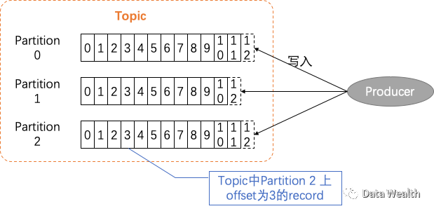
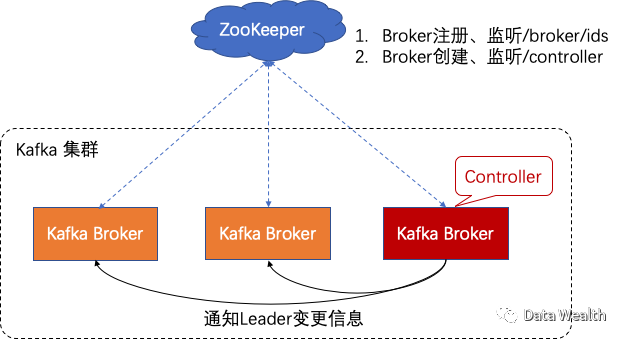

# 1. 前言

本文基于Kafka2.2

Kafka因其分布式、扩展性、可靠性、高效性，可能是应用最广的消息系统之一，特别是在构建实时流数据通道或者应用领域。Kafka以分布式集群的形式提供服务，整个Kafka集群可以在同一个数据中心，也能跨数据中心部署。



Kafka将record流按照Topic进行存储，每个Topic可以有一个或者多个Partition，Partition是Topic的存储单位，在每个Partition中，record是有序、且不可变更的。在一个Partition中用offset来唯一定义某一条记录。一个Partition实际存储在Kafka 集群的一个服务器的一块磁盘上，它的大小受磁盘的大小限制（Kafka server进程称为Broker，下文都假设Kafka集群的一个服务器上只允许一个Broker）。而一个Topic可以有多个Partition，因此一个Topic能处理的数据大小，理论上可以任意大小。

为了保障可靠性，通常将一个Partition设置多个副本，这些Partition副本的其中一个负责读写操作，称为leader ，来自Client（Producer、Consumer）的读写请求都被安排到leader，其它副本尽量保持自身与leader同步，它们被称为follower。当leader crash时，Kafka将从这些处于同步状态（in-sync）的follower中选举出一个成为新的leader，未当选的follower改为从新leader保持同步。

宏观上，Kafka集群中存在多个Topic，这些Topic的Partiton分布在整个Kafka集群，每一broker上都可能会有一个或者多个leader partition，所以整个集群每个broker都在处理请求。

# 2. 集群关系维护



Kafka通过ZooKeeper维护整个集群的broker列表，每个broker会有一个唯一id（文件配置或者自动生成），每当broker进程启动的时候，它首先通过在ZooKeeper创建一个以ID为参数的临时节点（ephemeral node， 在/brokers/ids路径下）将自己注册到ZooKeeper上，其它Kafka组件通过订阅该路径，以获知broker被添加到集群，或者从集群中被移除。这样当试图启动两个ID一样的broker时，会失败，从而保证Kafka集群的每个broker都有一个唯一的ID。

## 2.1 控制器（Controller）

Controller是一种特殊的Broker，相比其它broker，controller broker还负责partition leader的选举。它通常由Kafka集群中第一个启动的broker担任，broker在启动的时候同时会向ZooKeeper创建/controller 临时节点，这样当有一个broker首先创建成功后，其它broker创建会失败，由此保证了一个集群同时只有一个controller，而其它的broker会继续观察ZooKeeper上的/controller。当这个Controller停止或者丢失连接时，ZooKeeper上的临时节点/controller也会消失，其它broker得到通知后，尝试创建新的controller节点，首先创建成功的broker成为新的Controller，剩下的继续观察，等待下一次机会。

每次新的Controller选举成功时，都会分配一个更大的controller epoch number（每次都会增加1），所有broker都知道当前的controller epoch，这样broker就可以忽略来自旧controller的消息。

当Controller得知有broker离开集群时，它需要为那些leader 在该broker上的partition指派一个新的leader。它来决定这些partition 谁来作为新leader（通常是partition副本列表中的下一个副本），然后通知所有包含这些partition的broker（不管是是leader还是follower）：这些partition的新leader和follower信息。同时，每个新leader知道它自己需要为producer、consumer请求服务了；而follower知道需要从新的leader备份record。

当有一个broker加入到集群时，Controller用新broker的ID来检查该broker是否有副本，如果有， Controller通知所有brokers这个新的变化，新broker开始从leader备份record。

- *Kafka利用ephemeral node来选举和通知controller有broker进出集群。*
- *Controller负责选举leader，Controller利用epoch number来防止脑裂。*

# 2 备份

Kafka中有两类副本：Leader和Follower。除了前文已描述的职责，Leader还知道哪个follower是和leader同步的，Follower通过备份到达leader的record来尝试尽量和Leader保持同步。


Follower向leader发送Fetch请求（和Consumer请求一样），Fetch请求包含follower想要获取的record的offset，leader发送record到这个follower作为响应。

通过查看每个副本请求的record的offset，leader可以知道每个副本落后的状况，如果一个副本超过10秒（replicat.lag.time.max.ms）没有请求，或者它和最新的record相差超过10秒，这个副本就被认为是未同步的（out-of-sync），只有同步（in-sync）的副本可以被选为新leader，未同步状态的副本是不能被选举为新leader的。

*==假设partition为3副本，如果两个follower被判定为out-of-sync，此时leader crashed ，那么该partition下线，直到leader恢复。==*

Partition在当前leader之外，还有一种leader：首选leader——在topic刚创建时的leader。因为它是partition首次创建时的leader，那时它是基于broker平衡选定的，所以更加希望首选leader是当前leader，以保证broker的负载平衡。默认（auto.leader.rebalance.enable=true），表示Kafka将检查那些：不是当前leader，但是处于in-sync状态的首选leader，然后触发leader选举，使得首选leader变为当前leader。

- *==副本列表中第一个副本，通常就是首选leader。==*
- *==当手动重新指派副本时，列表中的第一个，将成为首选leader。==*

# 3 请求处理

前文所述，client需将读写请求发送leader，client如何知道？这里通过metadata request得知。metadata request可以发送到集群中的任意broker，其响应中包含：请求的topoic列表中的每个topic的partitions，每个partition的replicas，以及leader replica。client将这些信息缓存，通过这些信息来引导produce、fetch请求发送到对应的broker。client定期更新这些信息（metadata.max.age.ms）。如Produce请求：


除此之外，Client收到“Not a leader”错误时，它会先刷新metadata， 然后在发送原来的请求。

## 3.1 写请求

当leader所在broker收到写请求时，首先做一些检查：

1. 是否有往指定的Topic写入的权限。
2. ack设置是否正确（ack只能是：0， 1， all中的一个）
3. 当ack=all时，是否有足够的in-sync副本可以用来写入（kafka可以配置当in-sync副本数不够时，拒绝消息写入），然后消息才会被写入本地文件系统。当ack=all时，写入请求将被保存在一个叫purgatory的缓存中，直到leader观察到follower都备份了该消息，写入请求才算完成，此时才会向client发送写成功的响应。

## 3.2 读请求

读请求用于client向leader读取一组topic的一组partition的一组消息，如要求读取topic A的partition 0上的offset 10之后的消息。client同时可以：

1. 设置broker可以返回每个partition的消息的大小（上限、下限），设置下限主要用于降低cpu、带宽使用率，在消息数据未达到下限之前，broker不返还数据。
2. 设置读取超时，在超时到达时，即使partition没有足够多的消息，broker也将它们返回给client，防止client永远等待。

在读取消息时，只有in-sync的消息是可被读取的。这样处理的出发点是，防止未同步的消息，在leader crash之后，导致消息丢失。


# 4 存储

如前所述，Kafka的基本存储单位是Partition，Partition只能同一块硬盘上，不能被拆分到多块硬盘，所以Partition的容量大小受限于硬盘的单一挂载点。

## 4.1 Partition分配

创建topic时，Kafka首先要在整个机器确定分配partition：
1. 均匀地分配topic的partition到所有brokers
2. 确认每个partition的每个副本在不同的broker
3. 如果brokers有机架信息，尽量将副本分配到不同的机架上（跨数据中心时，同理）。
   

假设在一个3个broker的Kafka集群上新建一个有4个partition，3副本的Topic。那么相当于有12个副本需要分配到这3个broker之上：
* 先决定leader：选择一个随机的broker（比如 broker 1），以循环的方式来决定leader们的位置。leader 0在broker 1，leader 1在broker 2，leader 2在broker 0，...。
* 再决定follower（leader的broker 加1）：leader 0 在broker 1上，它的第一个follower在broker 2，第二个在broker 0；leader 1 在broker 2上，它的第一个follower在broker 0，第二个在broker 1；...。


当有机架感知时，假设Broker 0，Broker 1在同一个机架，Broker 2在其它机架，此时Broker的顺序从0，1，2变为0，2，1。


确定了每个分区的副本在哪个broker之后，接下来要确定副本要存储到broker所在服务器的哪个目录下。Kakfa将新的Partition添加到patition个数最少的目录中（只看Partition个数，不管磁盘上的空间负载）。

## 4.2 文件管理

Kafka将每个Partition按segment存储，默认每片1GB或者一星期的数据。当segment的数据达到1GB或者一周时，会关闭这个segment文件，然后打开一个新的。当前正在写入的segment称为active segment，kafka只会删除inactive segment，而不会删除active segment。

假设设置了log只保留1天，但是每个segment包含了5天的数据， 这样因为Kafka不会删除active segment，数据实际会被保留5天。如果设置保存1周的数据，而segment每天1个，那么会发现partition最多会有7个segment文件。

Kafka会为每个partition的每个segment文件（包括inactive segment）保留一个打开文件的句柄，因此Kakfa通常需要很高的打开文件句柄数。

Kafka的日志目录下存在两类文件：index和log，log文件存储着数据。index索引帮助快速定位Partition的某条record（通过offset）。

```bash
$ tree kafka | head -n 6
kafka
├── events-1
│ ├── 00000000003064504069.index
│ ├── 00000000003064504069.log
│ ├── 00000000003065011416.index
│ ├── 00000000003065011416.log
```

### 4.2.1 文件格式

每个segment以一个文件存储，内部是消息以及它们的offset。存在磁盘的数据的格式和producer发送给broker时的数据格式一致，与后期发送consumer的数据格式也一致。消息格式，借用网上几张图说明：


消息压缩：


## 4.3 Log Compaction

通常 Kafka 会储存消息，然后在消息超时之后将之删除。有一种场景 : consumer 只需读取最新的数据（ 如应用在失败中恢复， 只要读取最近的状态) ， Kafka 通过 topic 的删除策略来实现对这种场景 的支持 : 删除比 retention time 老的 events ,只保留 topic 中每个 key 最新的 value 。 Kafka 压缩要求 key 不为 null 。

每个 log 可以分为 Clean 和 Dirty 两视图 :

- Clean : 消息已经被压缩过了，这部分每个 key 只包含 一个 Value ,它们是前一次压缩时的最新的值。
- Dirty:在上次压缩之后到来的数据。


通过log.cleaner.enable启用compaction , 每个broker会开启Compaction manager线程以及一组compaction线程。每个线程选择partition中 dirty消息比最高的partition进行clean操作。

如何压缩一个partition：cleaner线程读partition的dirty section, 并且在内存中创建一个map，每个map由16-byte的消息的key的hash和前一个相同key的消息的8-byte的offset组成。每个map只占用24bytes。1 GB的segment并且假设每个消息1 KB , 这样segment中有100 万个消息，通过压缩，只需24 MB即可。

可用的压缩内存是所有压缩线程共享的。如有1 GB的压缩Offset map和5个压缩线程，那么每个线程可以分到200 MB用来作为自己的Offset map。Kafka要求至少dirty section的至少一个 segment 能够fit Offset map，否则需管理员分配更多内存或者减少compaction线程数。

Cleaner线程build了offset map之后，它开始读clean segment（从最老的地方开始，对比offset map检查它们的 Content )。检查消息的key 是否存在于offset map中，如果不存在且该值是最新的，则 copy 消息到replacement segment，如果key已经存在，则忽略该消息（因为已经有一条有相同key，但是Value更新），当 复制了所有的消息之后，将original segment和replacement segment交换，然后移到下一个 segment，这样最后只留下：每个key只有一个massage。


### 4.3.1 Deleted Events

要删除某个key的所有消息，Application必须生产一个包含该key而Value为Null的消息，clean线程收到这样的消息后。首先做一次普通的 compaction。然后用null代替仅剩的消息的Value ，这条消息被称为 tombstone 。这类消息会保留一段时间( 该时间可配置) ，在这段时间内这个消息仍可见，并且可知它已被删除。这样当将数据从复制到database时，知道要将对应 Key 的纪录删除。在该时间之后，clean线程将 删除tombstone消息，对应的key也会从kafka的Partition中被移除。

### 4.3.2 什么时候进行 topic Compaction

与删除策略一样，压缩策略不会对当前active segment进行压缩，压缩的对象是inactive的Segment文件。

在0.10.0之前的版本，在一个topic的dirty record达到50%时起动。

# 5 参考

- http://kafka.apache.org/documentation/
- https://hackernoon.com/apache-kafkas-distributed-system-firefighter-the-controller-broker-1afca1eae302
- https://www.confluent.io/resources/kafka-the-definitive-guide/
- https://blog.csdn.net/u013256816/article/details/80300225